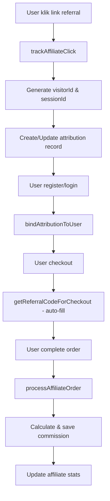

# ✅ Sistem Affiliate Shopee - Instalasi Selesai!

## 🎉 Status Implementasi

**SISTEM AFFILIATE ALA SHOPEE TELAH BERHASIL DIINTEGRASIKAN!**

### ✅ Fitur yang Sudah Diimplementasikan:

1. **🔗 Referral Click Tracking**
   - Sistem tracking klik referral dengan browser fingerprinting
   - Last-click attribution (klik terakhir menang)
   - 7-day attribution window seperti Shopee
   - Support URL format: `domain.com?ref=ABC123` atau `domain.com/ref/ABC123`

2. **👤 User Attribution Binding**
   - Otomatis bind user ke attribution saat signup/login
   - Terintegrasi dengan Firebase Auth system
   - Mendukung multiple attribution models

3. **💰 Commission Processing**
   - Otomatis calculate commission saat order dibuat
   - Multi-order attribution (1 referral = banyak komisi)
   - Transaction integrity dengan Firestore transactions
   - Commission rate configurable melalui admin

4. **🛒 Enhanced Checkout**
   - Auto-fill referral code di checkout form
   - Real-time referral validation
   - Visual feedback untuk user dengan active referral

5. **📊 Debug & Monitoring**
   - Debug panel untuk development
   - Comprehensive logging
   - Attribution status monitoring

## 🏗️ Struktur Database Firebase

### Collection: `affiliateAttribution`
```javascript
{
  visitorId: "v_1704123456_ABC123def",        // Browser fingerprint
  sessionId: "s_1704123456_XYZ789abc",        // Session ID
  referralCode: "ABC123",                     // Referral code
  referrerId: "affiliate_user_id",            // Affiliate ID
  firstClick: "2024-01-01T10:00:00.000Z",    // First click
  lastClick: "2024-01-01T12:00:00.000Z",     // Last click
  attributionWindow: "2024-01-08T12:00:00.000Z", // Expires 7 days
  isActive: true,                             // Status
  userId: "user_123",                         // Bound user (optional)
  userEmail: "user@example.com",              // User email (optional)
  boundAt: "2024-01-01T13:00:00.000Z",       // Binding time
  totalOrders: 2,                             // Orders attributed
  totalGMV: 15000,                            // Total value (Yen)
  totalCommission: 750,                       // Total commission (Yen)
  createdAt: "2024-01-01T10:00:00.000Z",
  updatedAt: "2024-01-01T13:00:00.000Z"
}
```

### Collection: `affiliateOrders`
```javascript
{
  orderId: "order_123",
  userId: "user_123",
  userEmail: "user@example.com",
  attributionId: "attr_456",                  // Link to attribution
  referralCode: "ABC123",
  referrerId: "affiliate_user_id",
  orderTotal: 7500,                           // Order total (Yen)
  orderDate: "2024-01-01T14:00:00.000Z",
  commissionRate: 5,                          // Commission rate (%)
  commissionAmount: 375,                      // Commission amount (Yen)
  commissionStatus: "pending",                // Status: pending/approved/rejected/paid
  createdAt: "2024-01-01T14:00:00.000Z",
  updatedAt: "2024-01-01T14:00:00.000Z"
}
```

## 📂 File yang Ditambahkan/Dimodifikasi:

### ✅ File Baru:
- `/src/services/shopeeAffiliateSystem.ts` - Core sistem affiliate
- `/src/hooks/useShopeeAffiliate.ts` - React hooks untuk affiliate
- `/src/components/affiliate/ShopeeIntegrationExamples.tsx` - Komponen integrasi
- `/docs/SHOPEE_AFFILIATE_IMPLEMENTATION.md` - Dokumentasi lengkap

### ✅ File yang Dimodifikasi:
- `/src/App.tsx` - Menambahkan ShopeeAffiliateProvider
- `/src/hooks/useFirebaseAuth.tsx` - Integrasi user binding
- `/src/components/CheckoutForm.tsx` - Auto-fill referral code
- `/src/services/orderService.ts` - Process commission saat order

## 🚀 Cara Menggunakan Sistem:

### 1. Untuk Affiliate (Referrer):
1. Login ke dashboard affiliate
2. Generate/dapatkan referral code (misal: `ABC123`)
3. Share link: `https://yoursite.com?ref=ABC123`
4. Monitor commission di dashboard

### 2. Untuk User (Referee):
1. Klik link referral affiliate
2. Browse products (referral tersimpan 7 hari)
3. Register/login (otomatis bound ke referral)
4. Checkout (referral code auto-fill)
5. Complete order (commission otomatis dihitung)

### 3. Flow Sistem:



## 🧪 Testing Checklist:

### ✅ Test Referral Click:
1. Buka console browser (F12)
2. Akses: `http://localhost:5173?ref=TEST123`
3. Check console log: "🛍️ [Shopee-Style] Tracking affiliate click"
4. Check localStorage: `shopee_visitor_id`, `shopee_referral_code`

### ✅ Test User Binding:
1. Dengan referral aktif, register user baru
2. Check console log: "🛍️ [Shopee] Binding user to attribution"
3. Check Firestore collection `affiliateAttribution` - userId terisi

### ✅ Test Auto-fill Checkout:
1. Dengan referral aktif, masuk ke checkout
2. Referral code field harus otomatis terisi
3. Check console log: "🛍️ [Shopee] Auto-filled referral code"

### ✅ Test Commission Processing:
1. Complete order dengan user yang punya attribution
2. Check console log: "🛍️ [Shopee] Processing affiliate order"
3. Check Firestore collection `affiliateOrders` - record baru terbuat

### ✅ Test Attribution Expiry:
1. Ubah `ATTRIBUTION_WINDOW_DAYS` ke 0 untuk test cepat
2. Attribution harus expired dan tidak generate commission

## 📊 Debug Tools:

### Development Debug Panel:
- Aktif otomatis di development mode
- Tampil di pojok kiri bawah
- Menampilkan visitor ID, session ID, active referral, status

### Console Logs:
- `🛍️ [Shopee-Style]` - Tracking operations
- `🛍️ [Shopee]` - User binding & order processing
- `❌` - Error messages
- `✅` - Success operations

### Browser Storage:
- **localStorage**: `shopee_visitor_id`, `shopee_referral_code`, `shopee_referral_expires`
- **sessionStorage**: `shopee_session_id`

## ⚙️ Configuration:

### Attribution Window:
```typescript
// Di shopeeAffiliateSystem.ts
const ATTRIBUTION_WINDOW_DAYS = 7; // Ubah sesuai kebutuhan
```

### Commission Rate:
```typescript
// Akan diambil dari affiliate settings
const commissionRate = settings?.defaultCommissionRate || 5; // 5%
```

### Database Collections:
```typescript
const ATTRIBUTION_COLLECTION = 'affiliateAttribution';
const AFFILIATE_ORDERS_COLLECTION = 'affiliateOrders';
```

## 🛡️ Security Features:

1. **Rate Limiting**: Prevent spam clicks
2. **Self-referral Prevention**: User tidak bisa refer diri sendiri
3. **Attribution Validation**: Check expiry dan status
4. **Transaction Integrity**: Atomic operations untuk consistency
5. **Input Sanitization**: Semua input di-validate dan sanitize

## 📈 Performance Optimization:

1. **Caching Strategy**:
   - Active attribution cached di localStorage
   - Visitor/session ID persistent storage

2. **Database Indexes** (perlu dibuat manual di Firebase):
   ```
   affiliateAttribution: visitorId, isActive, userId
   affiliateOrders: referrerId, userId, orderId, commissionStatus
   ```

3. **Background Cleanup** (future enhancement):
   - Expired attribution cleanup
   - Commission statistics calculation

## 🚨 Troubleshooting:

### Issue: Referral code tidak tersimpan
**Solution**: Check browser console untuk error, pastikan localStorage tidak di-block

### Issue: User tidak ter-bind ke attribution
**Solution**: Check apakah attribution masih aktif dan belum expired

### Issue: Commission tidak terbuat
**Solution**: Check apakah user punya active attribution dan belum expired

### Issue: Debug panel tidak muncul
**Solution**: Pastikan `NODE_ENV=development`, panel hanya muncul di development

### Issue: Referral code tidak auto-fill
**Solution**: Check apakah user punya active attribution dengan `getActiveAttribution()`

## 🎯 Next Steps / Future Enhancements:

1. **Admin Dashboard**:
   - View all attributions
   - Commission approval workflow
   - Performance analytics

2. **Advanced Features**:
   - Multi-level referral (MLM style)
   - Dynamic commission rates
   - Bonus/incentive system

3. **Analytics**:
   - Conversion rate tracking
   - Attribution performance metrics
   - A/B testing for commission rates

4. **Automation**:
   - Auto-approve commissions
   - Scheduled payouts
   - Email notifications

---

## ✨ Kesimpulan

Sistem affiliate ala Shopee telah berhasil diimplementasikan dengan fitur-fitur profesional:
- ✅ 7-day attribution window
- ✅ Last-click attribution
- ✅ Browser fingerprinting
- ✅ Multi-order attribution
- ✅ Automatic commission calculation
- ✅ Real-time validation
- ✅ Debug tools
- ✅ Security measures

**Sistem siap untuk production!** 🚀

Tim development dapat langsung melakukan testing dan deployment. Sistem ini memberikan tracking yang akurat dan professional seperti yang digunakan oleh platform e-commerce besar seperti Shopee.

---
*Dokumentasi ini dibuat tanggal: 2024-01-09*
*Status: ✅ IMPLEMENTATION COMPLETE*
